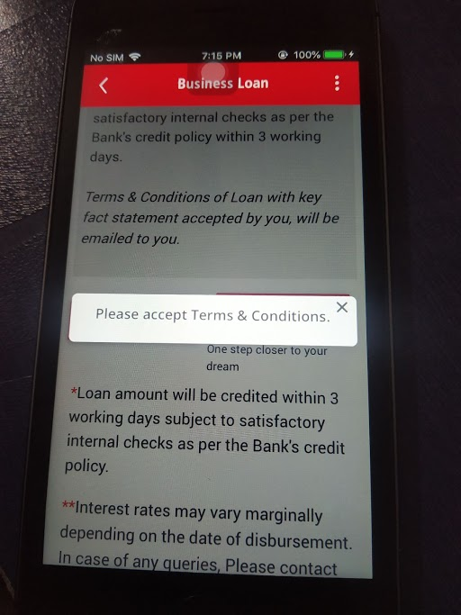

# Initial page

## heading one

### heading two

#### heading three

paragraph [something](https://www.google.com)

* bulletted list
* bulletted list item
* item
  * subitem
  * subitem
    * subsubitem
    * subsubitem
  * subitem
* item

1. ordered list
2. ordered list
   1. ordered list sub
   2. ordered list sub
      1. ordered list sub sub
      2. ordered list sub sub
   3. ordered list sub
3. ordered list

* [ ] task 1
* [ ] task 2
* [ ] task 3
  * [ ] subtask 1
  * [ ] subtask 2
    * [ ] subsubtask1
    * [ ] subsubtask2
  * [ ] subtask 3
* [ ] task 4

```text
hello from the code block
this is the second line
#now back to code
//comment
public void main(){
    System.out.println("hello from main function");
}
```

> this is quote
>
> subhash chandra bose said " tum mujhe khoon do main tumhe azadi dunga"
>
> we should follow the same



| student name | roll no |
| :--- | :--- |
| prajjwal | 72 |
| someone  | 74 |
| someone 2 | fad |


this is hint to do something






prajjwal



kinjal



tab



tab for






